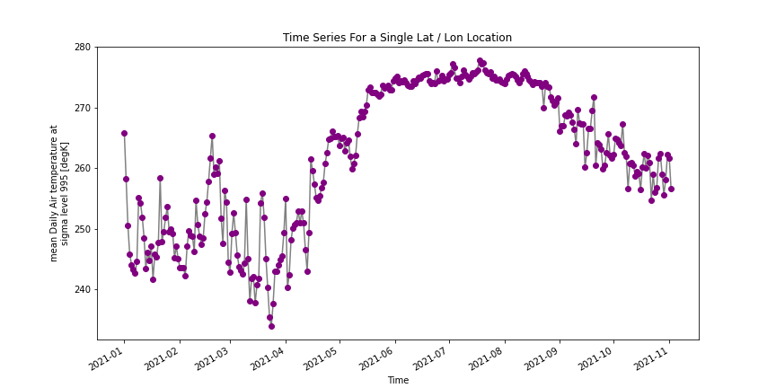

Kevin Dyer

11/7/2021

HWRS 501

HW11
____
### Grade
3/3 - Really nice job working with a different dataset!
____

1. A brief summary of the how you chose to generate your forecast this week.
Like the weeks prior, I used the function I created to generate my flow prediction. Wherein I get the median flow data from every day of the month of November since 1989, and then take the max value to represent my 1 week estimate, and the median value to be my 2 week estimate. However, due to historical flow increasing significantly towards the end of November each year, this method has proven to be not as useful for this kind of trend.

2. A description of the dataset you added:

A) What is the dataset? Why did you choose it?

I used the NCEP Reanalysis Daily Averages dataset from the NOAA website and selected the air temperature variable. I chose this variable because it was one of the very few daily average datasets available in the NCEP Reanalysis that wasn't precipitation, as we used that for our class example.

B) What is the spatial and temporal resolution and extent of the data ?

The dimensions of the dataset are lat: 73, lon: 144, time: 306, nbnds: 2.

C) Where did you get the data from?

I retrieved this data from the NOAA Physical Sciences Laboratory website

D) What was your approach to extracting and aggregating it into something useful to you?

To get the dataset to function I had to alter the starter code somewhat. I used the dataset.head() function to see the name of the column, “air”, which I needed for data analysis. I then used the find and replace functionality to replace all mentions of “prate” with “air”.

