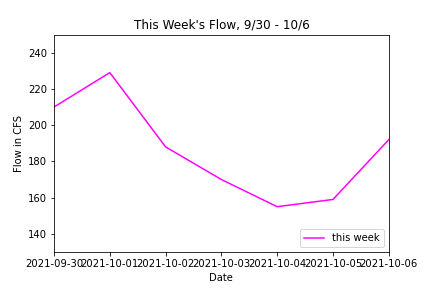
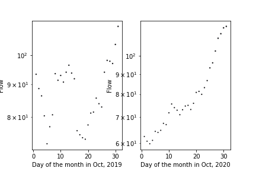
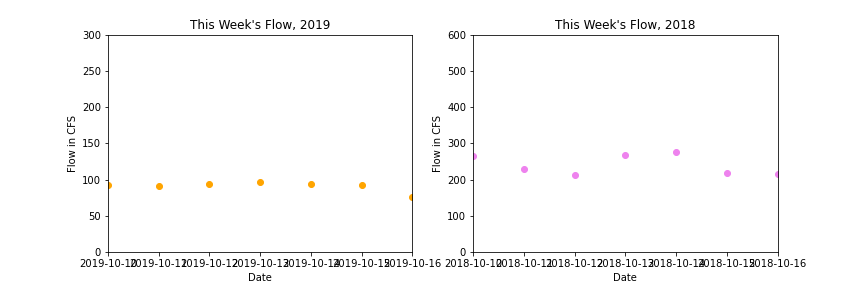

ReadMe
Assignment 7
Kevin Dyer
10-9-21

For Running code, please change name and path of week 7 flow
data to reflect that of your own code's name and location.

## Final Answers
Week 1 Forecast (10/10-10/16): 120.0 CFS \
Week 2 Forecast (10/17-10/23): 101.0 CFS \
Plot 1: \

Plot 2: \

Plot 3: \

Printed Information:

c:\Users\conna\Documents\HAS_Tools_Repo_Dump\Kevin_HW_Repo\Forecast_Submissions\Dyer_HW7
..\..\data\streamflow_week7.txt

Iteration 0 Day= 1 Flow= 155.0 \
Iteration 1 Day= 2 Flow= 156.0 \
Iteration 2 Day= 3 Flow= 157.0 \
Iteration 3 Day= 4 Flow= 159.0 \
Iteration 4 Day= 5 Flow= 154.0 \
Iteration 5 Day= 6 Flow= 158.0 \
Iteration 6 Day= 7 Flow= 161.0 \
Iteration 7 Day= 8 Flow= 161.0 \
Iteration 8 Day= 9 Flow= 160.0 \
Iteration 9 Day= 10 Flow= 154.0 \
Iteration 10 Day= 11 Flow= 161.0 \
Iteration 11 Day= 12 Flow= 167.0 \
Iteration 12 Day= 13 Flow= 169.0 \
Iteration 13 Day= 14 Flow= 168.0 \
Iteration 14 Day= 15 Flow= 168.0 \
Iteration 15 Day= 16 Flow= 170.0 \
Iteration 16 Day= 17 Flow= 171.0 \
Iteration 17 Day= 18 Flow= 176.0 \
Iteration 18 Day= 19 Flow= 168.0 \
Iteration 19 Day= 20 Flow= 169.0 \
Iteration 20 Day= 21 Flow= 167.0 \
Iteration 21 Day= 22 Flow= 161.0 \
Iteration 22 Day= 23 Flow= 163.0 \
Iteration 23 Day= 24 Flow= 169.0 \
Iteration 24 Day= 25 Flow= 163.0 \
Iteration 25 Day= 26 Flow= 159.0 \
Iteration 26 Day= 27 Flow= 170.0 \
Iteration 27 Day= 28 Flow= 174.0 \
Iteration 28 Day= 29 Flow= 180.0 \
Iteration 29 Day= 30 Flow= 178.0 \
Iteration 30 Day= 31 Flow= 173.5

My one week prediction for average flow is 120.0 ft^3/s, and my two week prediction is 101.0 ft^3/s. Both predictions are based off the median flow rates of Camp Verde from the Month of October since 2016. The 1 week prediction is the max of this subset of data due to the unusually high amount of rainfall recently, and the two week preidction is the median of this subset of data.

## Code Review:
#### Is the script easy to read and understand? (Are variables and functions named descriptively when useful? Are the comments helpful? Can you run the script on your own easily? Are the doc-strings useful?)

###### Score: (2/3)

Since I am working directly in your repo, it makes more sense to direct me to where you house your data since the relative path will be much simpler. To fix your path you would need to change the filepath function to the code line below:

Original code (line 14): \
filepath = os.path.join('..\data', filename)

Adjusted code: \
filepath = os.path.join('..\..\data', filename) (see in regular view, not preview mode for proper path format)

If you tried to have me access my own data file in my repo, the relative file path is much longer. This is because I would have to jump up more levels to access my own repo than if I only went up two levels to access your data file.

Code if you were sending me to my own data folder: \
filepath = os.path.join('..\..\..\homework\working_drafts\data', filename)

\
The structure of your function looks pretty good. I would recommend adding some docstrings in the future as they can provide helpful information, especially with complicated functions that involve things like for loops.

I would also recommend renaming the 'year' parameter as something like 'startyear' to make it clearer for users when running the function later. If someone runs the code without reading through the entire for loop, it could be confusing as to whether the function was returning an array for just one month of data (for just the year 2016) or multiple years. If you want to apply this function in more complicated codes later on it would be helpful to be clear about what exactly the parameters refer to.

\
Your comment descriptions in general could be more consistent in style. It is more polished to comment all plots the same way rather than to have multiple styles. For example, if you comment one plot as "Graph 1:" with some description, I would suggest you apply this to the others as well.

#### Does the code follow PEP8 style consistently? (If not are there specific instances where the script diverges from this style?)

###### Score: (3/3)

Generally follows PEP8 standards, just a few spots that need slight work. Pay special attention to lines being too long in the code. Lines 60-62 especially. The slashes are not needed on lines 60 and 61 since the commas already allow you to separate the arguments between different lines. However, you could use the slashes on line 62 since this text string is really long and needs to be broken up.

\
Also, be careful about consistency with spaces around operators and keywords. On lines 87 and 89 for example, there are some places you have it right and some places you don't. Check linter for help on catching these.

#### Is the code written succinctly and efficiently? (Are there superfluous code sections? Is the use of functions appropriate? Is the code written elegantly without decreasing readability?)

###### Score: (2/3)

Overall it looks good. Line 48 in your function definition is not necessary, you can just delete it.

\
One note on running your function is that the way you have it set up now, the input does not produce any output when the whole code is run. The defined function is supposed to automatically print an array of the median flow variables for whatever month is selected. However, when you wrote the code to test the function, you assigned a variable to it. When you did this, it made it so that the function didn't return the array automatically the way you defined it to in the function. So when the code is run, nothing comes out in the interactive window except the initial comment at the beginning of the cell (line 51). To adjust this I would recommend either:

1.) Just running the function. The code below is how you could change it.

Year = 2016 \
Month = 10 \
Days = 31

flow_median(Year, Month, Days, data)

This would run the function the way it was defined and would print the array automatically.

or

2.) Leave it as you have coded it with a variable assigned to the function, but make sure you print the variable after assigning it.

Year = 2016 \
Month = 10 \
Days = 31

flow_subset = flow_median(Year, Month, Days, data) \
print(flow_subset)

Either of these options gives you the same result, a printed version of the array, but it's simpler to just run the function as is instead of assigning a variable to it. Rewriting the code with option 1 will make your code more concise.

\
For plot 2 I would suggest simplifying your code from using 'c=' and 'cmap=' to using 'color='. While 'c=' and 'cmap=' are technically correct, you have your plots set up to only plot one year of data. Using a colormap is not as helpful for only one year of data because it is not a range of years. The colormap is only providing the first color on the colormap to the plot because it only has one year of data to color. This is why the points plot as the dark blue-black color. That is the first color on the 'magma' colormap. Using 'color=' gives you more flexibility with choosing colors for your plot and will simplify your code.

I would also recommend experimenting with 'facecolor=' which adds background colors to plots in matplotlib. This helps make plots more readable after saving them to files. This parameter is used with the fig variable like so:

fig.set(facecolor='brown')
