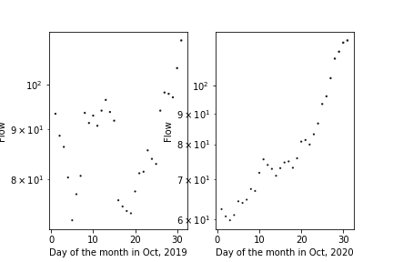

Kevin Dyer
10/18/21
Homework 8

1. An explanation of how you generated your forecasts and why?
My forecasts are generated through gathering the median flow data of every day in the month of October since 1989. I then subset the data, looking only at the median flows for days in October since 2011, ie. the last ten years. Because of the unusually high amount of rainfall we've gotten this last month, I decided to take the max value of this subset of data for my week 1 prediction and got a value of 131 CFS. For my two week prediction, because of my foreseeing of the monsoon season's end, I took the median value of the subset of data from the last 10 years and got a value of 114 CFS.

2. The three graphs you are including with an explanation of why you chose these three graphs.

This is a line graph of the previous week's flow as I thought it would be useful to see where the trends were going heading into this week.

This is a scattergraph of October 2019 and October 2020's daily flow throughout the month, side by side for easy comparisons. I chose to make this graph as I believe trends from this month in recent years can showcase what's to come for this year.

Finally, I made another scattergraph, this time honed in specifically on this week's flow in the years of 2019 and 2020. While the last graph was useful in seeing broad trends in flow, I believe this one helps one to see the minute changes day-to-day that could happen once again this year.

3. A brief summary of what you got out of the peer evaluation. How did you make your script better based on the feedback you received?
My peer reviewer helped me out a lot, actually. I believe I implemented most of their feedback into my script and I think it greatly improved my scripts readability and usability on other devices. First I changed my data path to look two tabs up for the data its looking, as my peer-reviewer was having trouble getting the data from their own data's location. I also added docstrings for my function, at the suggestion of my peer-reviewer. They go into more detail about the ins and outs of my function, its parameters, and what it returns.

4. A summary of how you are using timeseries functionality in your script.
I used timeseries in both my LastWeeksFlow and This_week_2018_2019 graphs. For both I used the "DateFormatter" tool to unclog the x axis of my graphs and improve their readability. For LastWeeksFlow I used only month and day to clear up some space. And because This_week_2018_2019's x axis was all from the same week, I used only the day number for its x-axis.

5. Describe the part of your script that you are most proud of and why.
I'm most proud of my function because of the work I put into refining and getting it to work. It was the example we used in class when we were refining our assignment 7 functions, and that feedback really helped me to push forward and create something that I was proud of.
